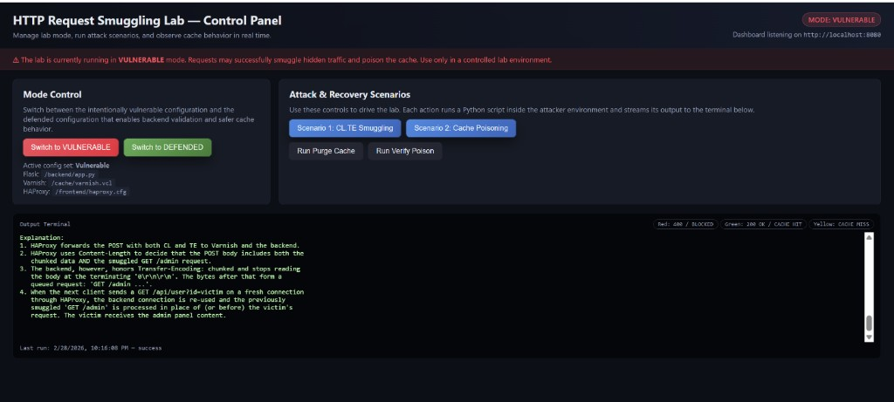

# HTTP Request Smuggling + Cache Poisoning Lab

This project is an intentionally vulnerable three-tier web stack that demonstrates **HTTP/1.1 request smuggling** (CL.TE desynchronization) and **web cache poisoning**. It shows how a front-end proxy and back-end server can disagree on request boundaries, allowing an attacker to smuggle a hidden request and poison a shared cache so that all users receive malicious content. A **web Control Panel** (dashboard) lets you switch between vulnerable and defended configurations and run the attack scenarios with one click. This repository is a **web security final project** for academic and research use.

---

## About This Project

### The CL.TE Desync Vulnerability

In HTTP/1.1, request body boundaries can be specified by **Content-Length** (byte count) or **Transfer-Encoding: chunked** (chunked encoding). When a request contains *both* headers, different components may interpret it differently:

- A **front-end** (e.g. HAProxy) might honor **Content-Length** and treat the entire byte stream as one request body.
- A **back-end** (e.g. Flask/Werkzeug) might honor **Transfer-Encoding: chunked** and stop reading at the chunk terminator `0\r\n\r\n`.

The bytes *after* that terminator are then left in the TCP buffer. On the next request over the same connection, the back-end sees those bytes as the *next* request. An attacker can thus **smuggle** a second request (e.g. `GET /admin`) that is processed when an innocent user’s request is sent later.

### Chaining with Cache Poisoning

If the smuggled request targets a **cacheable** URL (e.g. `/api/user`) and is sent with privileged headers (e.g. `X-Admin-Auth: secret-token`), the back-end returns admin-only data. The cache (Varnish) stores that response under a key that normal clients also use (e.g. path-only `/api/user`). Every subsequent user requesting `/api/user` then receives the **poisoned** admin response until the cache entry expires or is purged.

### Related Resources

This lab aligns with the following PortSwigger Web Security Academy topics:

- [Exploiting HTTP request smuggling to bypass front-end security controls, CL.TE vulnerability](https://portswigger.net/web-security/request-smuggling/exploiting#bypassing-front-end-security-controls-cl-te-vulnerabilities)
- [Exploiting HTTP request smuggling to perform web cache poisoning](https://portswigger.net/web-security/request-smuggling/exploiting#web-cache-poisoning)

An academic final project report (Word/PDF) was prepared for submission. If it is not visible in this repository, it was submitted separately (e.g., via the course submission system).

---

## Architecture

```
[Attacker]  →  [HAProxy :80]  →  [Varnish :6081]  →  [Flask :5000]
```

| Layer     | Technology   | Role                                      | Vulnerability / behavior                          |
|----------|--------------|-------------------------------------------|---------------------------------------------------|
| Front-end| HAProxy 2.4  | Reverse proxy, keep-alive, forwards CL+TE | Forwards requests with both CL and TE; reuses backend connections |
| Cache    | Varnish 7   | HTTP cache for `/api/*`                   | Hash ignores Cookie/Auth; path-only key for `/api/user` |
| Back-end | Flask        | API server, `/api/user`, `/admin`         | Honors TE: chunked; stops at `0\r\n\r\n`; queues leftover bytes |

External access is via **HAProxy on port 80** (lab traffic) and the **Dashboard on port 8080** (control panel). Varnish and Flask run on the internal Docker network.

---

## Control Panel (Dashboard)

A web-based **Control Panel** runs at **http://localhost:8080**. Use it to:



- **Switch mode:** "Switch to VULNERABLE" or "Switch to DEFENDED" — copies the corresponding configs (backend, Varnish, HAProxy) and restarts the affected containers. Wait ~5 seconds after switching for services to come back up.
- **Run attacks:** One-click buttons for **Scenario 1: CL.TE Smuggling** and **Scenario 2: Cache Poisoning**.
- **Recovery:** "Run Purge Cache" and "Run Verify Poison" to clear or check cache state.

The dashboard shows the current mode (VULNERABLE / DEFENDED), runs the attacker scripts inside Docker (targeting the frontend service), and displays script output in a terminal-style panel.

---

## Logical Flow (Normal Request Lifecycle)

The following shows the *intended* request/response flow for a normal user request (no smuggling):

```text
Client GET /api/user
  → HAProxy (frontend :80) forwards request to Varnish
  → Varnish checks cache:
      - HIT: return cached response (Age > 0 / X-Cache: HIT)
      - MISS: forward to Flask backend
  → Flask generates JSON (role: standard) with Cache-Control
  → Varnish stores response (per VCL rules) and returns it
  → Client receives JSON + cache headers
```

In the vulnerable scenario, smuggling manipulates how the back-end interprets request boundaries on a reused connection, which causes an attacker-controlled request to be processed “out of band” and potentially cached under a shared key.

---

## Attack Scenarios

### Scenario 1 — CL.TE Request Smuggling

**What it does:** Sends a single POST with both `Content-Length` and `Transfer-Encoding: chunked`. The body is crafted so the back-end ends the request at the chunk terminator while the front-end treats the whole thing as one body. The bytes after the terminator form a smuggled `GET /admin` that is executed when the next request is sent on a new connection (the “victim” request).

**Payload (conceptually):**

```http
POST / HTTP/1.1
Host: localhost
Connection: keep-alive
Content-Length: <length of entire body>
Transfer-Encoding: chunked

1\r\nX\r\n0\r\n\r\n
GET /admin HTTP/1.1\r\n
Host: localhost\r\n
X-Admin-Auth: secret-token\r\n
\r\n
```

**Expected output:**

- **Vulnerable:** Victim’s GET receives the admin panel response (smuggled request was executed).
- **With defenses:** Smuggling POST returns **HTTP 400 Bad Request**; victim’s GET receives normal `/api/user` data; no smuggled request reaches the back-end.

---

### Scenario 2 — Cache Poisoning

**What it does:** Uses the same CL.TE desync to queue a privileged `GET /api/user` with `X-Admin-Auth: secret-token`. A follow-up “trigger” GET causes that queued request to run; the back-end returns admin JSON, and Varnish caches it under `/api/user`. All later users get **role: admin** and **secret_key** from cache.

**Steps:**

| Step | Action | Purpose |
|------|--------|--------|
| **STEP 1** | GET `/api/user?id=guest` | Confirm clean cache; response has `role: standard`. |
| **STEP 2** | POST with CL+TE; body = chunked + smuggled `GET /api/user` + `X-Admin-Auth` | Queue privileged GET on backend connection. |
| **STEP 3** | GET `/api/user` on new connection | Trigger queued request; backend returns admin JSON; Varnish caches it. |
| **STEP 4** | Multiple GET `/api/user` | All served from cache with **role: ADMIN**, `secret_key: XK9#mP2$**. |

**Expected output (vulnerable):** STEP 1 = CACHE MISS, role: standard. STEP 3 and STEP 4 = CACHE HIT, role: admin, secret_key present. With defenses applied and cache purged, STEP 2 returns 400 and no poisoning occurs.

---

## Project Structure

```text
smuggling-lab/
├── docker-compose.yml
├── frontend/
│   ├── haproxy.cfg              # active (vulnerable or overwritten by secure)
│   └── haproxy_vulnerable.cfg   # backup minimal config for vulnerable mode
├── cache/
│   ├── varnish.vcl              # active (vulnerable or overwritten by secure)
│   └── varnish_vulnerable.vcl   # backup VCL for vulnerable mode
├── backend/
│   ├── Dockerfile
│   ├── app.py                   # active (vulnerable or overwritten by secure)
│   ├── app_vulnerable.py        # backup app without smuggling defenses
│   └── requirements.txt
├── dashboard/
│   ├── app.py                   # FastAPI control panel (HTML + API)
│   ├── Dockerfile
│   └── requirements.txt
├── attacker/
│   ├── smuggle_clte.py          # Scenario 1: CL.TE smuggling
│   ├── cache_poison.py          # Scenario 2: cache poisoning
│   ├── purge_cache.py
│   ├── verify_poison.py
│   └── ...
├── defenses/
│   ├── haproxy_secure.cfg
│   ├── varnish_secure.vcl
│   └── app_secure.py
└── README.md
```

| File / directory       | Purpose |
|------------------------|--------|
| `docker-compose.yml`   | Orchestrates backend, cache, frontend, and dashboard; internal network, health checks, backend volume mount. |
| `frontend/haproxy.cfg` | Active HAProxy config (overwritten by dashboard when switching mode). |
| `frontend/haproxy_vulnerable.cfg` | Minimal HAProxy config used when "Switch to VULNERABLE" is clicked. |
| `cache/varnish.vcl`     | Active Varnish VCL (overwritten by dashboard when switching mode). |
| `cache/varnish_vulnerable.vcl` | VCL used when "Switch to VULNERABLE"; includes PURGE handling. |
| `backend/app.py`       | Active Flask app (overwritten by dashboard when switching mode). |
| `backend/app_vulnerable.py` | Flask app without `block_ambiguous_framing`; used in vulnerable mode. |
| `dashboard/app.py`     | FastAPI app: serves control panel at `/`, API for run/mode/status; copies configs and restarts containers. |
| `attacker/smuggle_clte.py` | Scenario 1: CL.TE smuggling POST + victim GET. |
| `attacker/cache_poison.py` | Scenario 2: four-step cache poisoning. |
| `attacker/purge_cache.py`  | PURGE `/api/user` with X-Purge-Key; before/after cache state. |
| `attacker/verify_poison.py` | Multiple GET `/api/user`; POISONED vs CLEAN; optional `--bust`. |
| `defenses/haproxy_secure.cfg` | Hardened HAProxy: ACL for CL+TE, `http-server-close`. |
| `defenses/varnish_secure.vcl` | Hardened Varnish: PURGE with key, strict hash, CL+TE check. |
| `defenses/app_secure.py`     | Hardened Flask: blocks TE: chunked and CL+TE; security headers. |

---

## Installation & Quick Start

```bash
git clone https://github.com/Azrieli-College-of-Engineering/final-project-raghad-bayan
cd final-project-raghad-bayan/smuggling-lab
docker compose up --build
```

Then open **http://localhost:8080** in your browser for the **Control Panel**. Use the dashboard to switch between VULNERABLE and DEFENDED modes and to run the attack scenarios (CL.TE, Cache Poisoning), purge cache, and verify poison.

Optionally, run the attacker scripts from the command line (e.g. from a second terminal, with the lab already running):

```bash
cd final-project-raghad-bayan/smuggling-lab/attacker
python smuggle_clte.py
python cache_poison.py
```

Scripts use `TARGET_HOST` and `TARGET_PORT` from the environment; when run from the dashboard they target `frontend:80` inside Docker; when run locally they default to `localhost:80`.

---

## Running the Attacks

All attacker scripts use **raw Python sockets** and send byte-accurate HTTP/1.1 with `\r\n` line endings.

### smuggle_clte.py (Scenario 1)

1. Builds a POST to `/` with both `Content-Length` and `Transfer-Encoding: chunked`, body = chunked data + smuggled `GET /admin` with `X-Admin-Auth: secret-token`.
2. Sends the POST (connection may stay open).
3. Waits ~500 ms, then sends a new GET `/api/user?id=victim` on a fresh connection.

**Expected (vulnerable):** Response to the victim GET contains admin panel content. **Expected (defended):** POST gets 400; victim GET gets normal JSON.

### cache_poison.py (Scenario 2)

1. **STEP 1:** GET `/api/user?id=guest` — see CACHE MISS, `role: standard`.
2. **STEP 2:** Send CL.TE smuggling POST with smuggled `GET /api/user` + `X-Admin-Auth`.
3. **STEP 3:** GET `/api/user` — triggers queued request; backend returns admin JSON; Varnish caches it.
4. **STEP 4:** Several more GET `/api/user` — all CACHE HIT with admin data.

**Expected (vulnerable):** STEP 3 and STEP 4 show `role: admin`, `secret_key`, CACHE HIT. **Expected (defended):** STEP 2 returns 400; no poisoning.

### verify_poison.py

Sends five GET `/api/user` and prints body preview plus a POISONED/CLEAN verdict. Use `python verify_poison.py --bust` to send a cache-busting GET first.

### purge_cache.py

Sends GET → PURGE (with `X-Purge-Key: internal-purge-secret`) → GET for `/api/user`. Prints before/after cache state and CACHE HIT/MISS. Use after applying defenses to remove a poisoned entry.

---

## Applying Defenses

### Via the dashboard (recommended)

1. Open http://localhost:8080.
2. Click **"Switch to DEFENDED"**. Wait ~5 seconds for the backend, cache, and frontend to restart.
3. Click **"Run Purge Cache"** to remove any previously poisoned cache entry.
4. Run **Scenario 1** or **Scenario 2** again — the smuggling POST should return **400** and the victim should get normal data.

### Manually (copy + rebuild)

Copy the secure configs into the active locations and rebuild:

```bash
copy .\defenses\app_secure.py .\backend\app.py
copy .\defenses\varnish_secure.vcl .\cache\varnish.vcl
copy .\defenses\haproxy_secure.cfg .\frontend\haproxy.cfg
docker compose down && docker compose up --build
```

Then purge the cache and confirm the attack is blocked:

```bash
cd attacker
python purge_cache.py
python cache_poison.py
```

After purge: BEFORE may show CACHE HIT (POISONED), then PURGE 200, then AFTER shows CACHE MISS (CLEAN). Running `cache_poison.py` after that: STEP 1 CACHE MISS, STEP 2 HTTP 400, STEP 3 and STEP 4 CACHE MISS with `role: standard`.

---

## Demo Evidence (Recommended for Submission)

For strict grading, include screenshots or pasted outputs showing:

- **Vulnerable run**
  - Dashboard: Switch to VULNERABLE, then run Scenario 1 (CL.TE) — victim receives admin content; run Scenario 2 (Cache Poisoning) — STEP 3/4 show `role: admin` and CACHE HIT.
  - Or: `python smuggle_clte.py` / `python cache_poison.py` from the `attacker/` directory.
- **Defended run**
  - Dashboard: Switch to DEFENDED, wait ~5 s, run Purge Cache, then run Scenario 1 or 2 — POST returns **HTTP 400**, backend log shows `BLOCKED: Smuggling attempt detected ...`.
- **Recovery**
  - Dashboard: "Run Purge Cache" — BEFORE poisoned, PURGE 200, AFTER clean. Or: `python purge_cache.py` from `attacker/`.

These can be placed in the report or added to the repository as images under a `screenshots/` folder.

---

## Defense Mechanisms

| Defense | What it prevents | Where implemented |
|--------|-------------------|-------------------|
| Flask blocks TE: chunked | Smuggling requests from reaching application logic; primary mitigation when proxy does not see both headers | `app_secure.py`: `block_ambiguous_framing()` before_request |
| HAProxy ACL (CL+TE) | Intended to reject requests with both Content-Length and Transfer-Encoding | `haproxy_secure.cfg`: `acl has_cl`, `acl has_te`, `http-request deny` |
| Varnish strict cache key | Prevents cached admin response from being served for unauthenticated key | `varnish_secure.vcl`: hash includes Cookie, Host, URL; pass for Auth/Cookie |
| Varnish PURGE + X-Purge-Key | Allows operators to purge poisoned object after enabling other defenses | `varnish_secure.vcl`: `vcl_recv` PURGE + secret key |
| HAProxy 2.4 ACL limitation | In practice, HAProxy 2.4 strips Content-Length before ACL evaluation when Transfer-Encoding is present, so the CL+TE ACL does not fire; defense-in-depth only | Documented in `defenses/haproxy_secure.cfg` comment; real enforcement is in Flask |

---

## Key Findings

1. **HAProxy 2.4** silently strips or normalizes `Content-Length` when `Transfer-Encoding` is present, before ACL evaluation. Therefore, an ACL that checks for *both* headers does not see both and cannot reliably block CL.TE at the proxy in this setup.

2. **Cache poisoning persists after defenses are applied.** Once a poisoned response is stored, it is served until TTL expires or the entry is purged. Blocking new smuggling alone is not enough.

3. **Remediation requires both:** (a) block new smuggling (e.g. at Flask by rejecting TE: chunked or ambiguous framing), and (b) **purge** the affected cache entries (e.g. `purge_cache.py`) so existing poison is removed.

---

## Technologies

| Tool | Version | Purpose |
|-----|---------|--------|
| HAProxy | 2.4 | Front-end reverse proxy, HTTP/1.1 |
| Varnish | 7 | HTTP cache, VCL 4.0 |
| Flask | 3.0.x | Back-end API |
| FastAPI / Uvicorn | — | Dashboard (control panel) |
| Python | 3.11 | Attack scripts, backend, dashboard |
| Docker / Docker Compose | — | Orchestration (backend, cache, frontend, dashboard) |

---

## Limitations

Normalization is Key: Most smuggling attacks are prevented by forcing the proxy to only use one framing method.

Cache Invalidation: Simply patching the code isn't enough; existing poisoned entries must be purged manually.

HTTP/2 Mitigation: While this lab focuses on HTTP/1.1, moving to HTTP/2 largely eliminates desynchronization vulnerabilities.

Environment: This is a lab environment. Production systems should use TLS, WAFs, and stricter network segmentation.

---

## Sources

- [PortSwigger – HTTP request smuggling](https://portswigger.net/web-security/request-smuggling)
- [PortSwigger – Exploiting HTTP request smuggling (bypass front-end controls, cache poisoning)](https://portswigger.net/web-security/request-smuggling/exploiting)
- [RFC 7230 – Hypertext Transfer Protocol (HTTP/1.1): Message Syntax and Routing](https://datatracker.ietf.org/doc/html/rfc7230)
- [OWASP – HTTP Request Smuggling](https://owasp.org/www-community/attacks/HTTP_Request_Smuggling)
- James Kettle – [HTTP Desync Attacks: Request Smuggling Reborn](https://portswigger.net/research/http-desync-attacks-request-smuggling-reborn) (Black Hat USA 2019)
